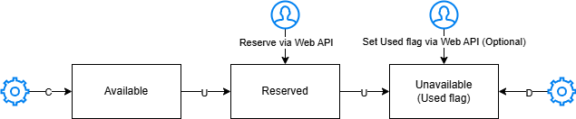

# Azure Unreal Pixel Streaming Scaler

## Scenario

The bigger project is develop a web site with embedded Unreal Pixel Streaming experience in the web browser. The concrete task is develop Azure Unreal Pixel Streaming Scaler which will dynamically reprovision new VMSS instances with Unreal for pixel streaming over time.

## Solution Architecture

Scaler component is a part of Azure Unreal Pixel Streaming solution. Unreal experience will be made available through GPU-enabled VMs in Azure with Virtual Machine Scale Set (VMSS). VMSS will consist of multiple instances serving multiple users simultaneously. Users will make "reservations" of VMSS instances from the external web site, the declarative state of VMSS instances for reservations will be stored in Azure Redis Cache.

Scaler components is an internal component which will not be accessed from outside, and it will only integrate with VMSS and Redis on the inside. Scaler functionality is broken down into a set of microservices working independently but in concert. Scaler essentially implements state machine functional pattern by moving VMSS instance representation from Available through Reserved to Unavailable status(es). VMSS instance will be short-lived for security considerations. After VMSS instance has been used, it will be deleted by the Scaler component. Later the Scaler will reprovision a new VMSS instance to be ready for the next user reservation.

Solution Architecture for Azure Unreal Pixel Streaming Scaler is depicted on this diagram 

### Compute Infrastructure

Azure Container Instances (ACI) will be used to deploy and host solution components as individual containers. Each container will be built via Azure DevOps CI pipeline and published into Azure Container Registry (ACR). Deployment of containers into Azure Container Instances (ACI) will be done by means of Azure DevOps CD pipeline. 

### Interservice Communication

Scaler components will manipulate with VMSS instances and use Redis as a shared data resource. Each VMSS instance may be represented with the following statuses in Redis:

1. Available: After reconciler creates a new record for provisioned VMSS instance which has been stopped
2. Reserved: After user in the external web site makes a reservation of VMSS instance by changing the associated Redis record via Queue Manager Web API call to Redis
3. Unavailable: After starter starts VMSS instance making it available for the Unreal Pixel Streaming experience

### Data Considerations

Each Scaler component will work with Redis record to advance it through the state machine. The Redis record will contain the following fields:
- VMID
- InstanceID
- Status (Available, Reserved, Unavailable)
- Used (true/false)

The following Redis indices will be used:
- vmss:instance:* (VMID = GUID)
- vmss:status:available (set-based index)
- vmss:status:reserved (set-based index)
- vmss:status:unavailable (set-based index)

Reconciler will create Redis records in Available status, users from external web site via Web API call by Queue Manager will change the status to Reserved, Starter will change the status to Unavailable when VMSS instance is started, and Cleaner will delete the Redis record when VMSS instance is marked as Used. The only Scaler component which will not work with Redis is Provisioner, which will only create and stop VMSS instances.  

State Machine pattern is depicted on this diagram 

### Design Patterns

Scaler will be implemented using Microservices architecture pattern. Each component will be a separate microservice with its own responsibilities and will contribute to moving Redis records for VMSS instances through their entire life cycle (Available -> Reserved -> Unavailable). The components will be loosely coupled but tightly integrated, allowing for independent development, deployment, and scaling.

## Solution Components

1. Provisioner: Creates and stop VMSS instances. Provisioner will be checking the size of VMSS scale set and will create new VMSS instances if the size is below the configured desired size.
2. Reconciler: Creates Redis records for VMSS instances. Reconciler will be checking the state of VMSS instances and will create new Redis records for newly created VMSS instances.
3. Starter: Starts VMSS instances upon reservation. Starter will be checking the Redis records for VMSS instances and will start the VMSS instance when it is reserved.  
4. Cleaner: Deletes used VMSS instances. Cleaner will be checking the Redis records for VMSS instances and will delete the VMSS instance when it is marked as used.

## Solution Implementation

1. Assume Managed Identity is used for service to service communication between Scaler, VMSS and Redis
2. Each solution component will work with Azure resources via Azure SDK for Go
3. Each solution component will be implemented as a separate Go package
4. Each solution component will run continuously on a configurable cadence
5. Use `cmd` folder for main packages per component
6. Use `pkg` folder for reusable packages for VMSS and Redis interfaces
7. Use `.azure-pipelines` folder for Azure DevOps CI/CD pipelines

## Out of Scope

1. Implementation and deployment of Match Maker Server (and Queue Manager) is out of scope
2. Deployment of VMSS and Redis resources in Azure is out of scope
3. Implementation and deployment of external web site is out of scope
